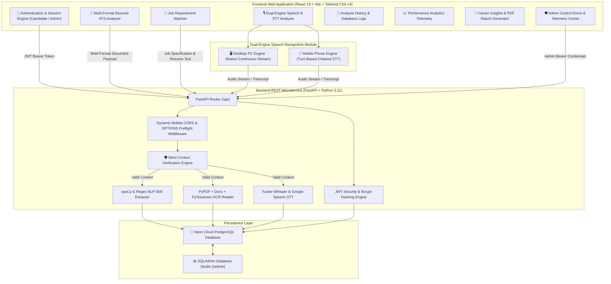

<div align="center">

  <h1>🛡️ HireSense AI</h1>
  <p><b>Advanced Full-Stack AI Recruitment & Career Telemetry Platform</b></p>

  <p>
    <a href="https://hiresenseai-zeta.vercel.app/" target="_blank">
      
    </a>
    
    
    
    
    
  </p>

</div>

---

## 📌 Executive Overview

**HireSense AI** is a state-of-the-art, production-grade recruitment intelligence and interview telemetry platform. Built with a high-performance **Glassmorphic UI**, it empowers job seekers, candidates, and recruiters with real-time NLP analysis, multi-format document OCR, dual-engine speech-to-text processing, and dynamic database telemetry.

Unlike generic tools, **HireSense AI** enforces strict **Context Verification**: invalid non-resume documents, unsupported files, or empty speech streams are cleanly rejected with HTTP 400 errors instead of returning fake or hardcoded mock scores.

---

## 🏗️ System Architecture



---

## 👥 Roles & Capabilities

### 👤 Candidate / User Capabilities
1. **📄 Multi-Format Resume ATS Analysis**:
   - Supports **PDF**, **DOCX**, **DOC**, **TXT**, and **Images** (`.png`, `.jpg`, `.jpeg`, `.webp`).
   - Extracts real candidate skills, evaluates ATS readability (0–100%), and calculates exact word counts.
   - Enforces **Context Validation**: Non-resume photos or random non-career text are rejected with `Document rejected: Missing resume context`.

2. **🎯 Job Description Requirement Matcher**:
   - Evaluates candidate profile alignment against target job specifications.
   - Highlights real matched skills and missing competency gaps without hardcoded fallbacks.

3. **🎙️ Speech-to-Text & Interview Articulation Analytics**:
   - **Dual-Engine Architecture**: Dedicated continuous recognition on Desktop PC and touch-optimized chained recognition on Mobile (iOS Safari & Android Chrome).
   - Measures Words Per Minute (WPM), filler word count (`um`, `uh`, `like`), sentiment, and articulation scores.

4. **📜 Analysis History & Database Logs**:
   - Scoped strictly to the candidate's account. Persists all valid historical analyses in Neon PostgreSQL.

5. **📈 Performance Analytics**:
   - Visualizes aggregate resume ratings, job compatibility scores, and interview articulation trends over time.

6. **📄 Career Insights & PDF Report Export**:
   - Generates formal, downloadable candidate PDF reports featuring ATS metrics, verified skills, and actionable career guidance.

---

### 🛡️ Admin Capabilities
1. **Admin Control Room (`chirag@hiresense.ai`)**:
   - Platform-wide telemetry monitoring total registered users, aggregate average scores, and top detected skill gaps.
   - User account management and database health monitoring via **SQLAdmin Studio**.

---

## 🌐 Live Production Endpoints

| Component | Provider | URL Endpoint |
| :--- | :--- | :--- |
| **Frontend Application** | Vercel | [https://hiresenseai-zeta.vercel.app/](https://hiresenseai-zeta.vercel.app/) |
| **Backend REST API** | Render | `https://hiresense-ai-backend-km18.onrender.com/api` |
| **OpenAPI Documentation** | Render | `https://hiresense-ai-backend-km18.onrender.com/docs` |
| **Cloud Database** | Neon Cloud | Managed PostgreSQL (us-east-2) |

---

## 🔑 Demo Credentials

| Role | Name | Email Address | Password |
| :--- | :--- | :--- | :--- |
| **Admin** | Chirag Roshan | `chirag@hiresense.ai` | `123456` |
| **User (Test)** | Candidate | `exhaustignite@gmail.com` | `123456` |

---

## 🛠️ Technology Stack

- **Frontend**: React 19, Vite, Tailwind CSS v4, Framer Motion, Lucide Icons, Axios, jsPDF, html2canvas.
- **Backend**: FastAPI, Python 3.11, SQLAlchemy ORM, Neon Cloud PostgreSQL, PyPDF, Python-Docx, PyTesseract OCR, Faster-Whisper, SpeechRecognition, SQLAdmin.
- **Security & Infrastructure**: JWT Authentication, Password Hashing (Bcrypt), Custom OPTIONS Preflight CORS Middleware, NUL-Byte DB Sanitization.

---

## 🚀 Local Setup Guide

```cmd
# 1. Clone Repository
git clone https://github.com/chiragroshan18/hiresenseai.git
cd hiresenseai

# 2. Setup & Start Backend
cd backend
python -m venv venv
venv\Scripts\activate
pip install -r requirements.txt
python -m uvicorn app.main:app --reload --port 8000

# 3. Setup & Start Frontend (in a second terminal)
cd frontend
npm install
npm run dev
```

Visit `http://localhost:5173` in your browser.

---

## 📄 License

Developed & Maintained by **Chirag Roshan** for **HireSense AI**.  
Distributed under the **MIT License**.
