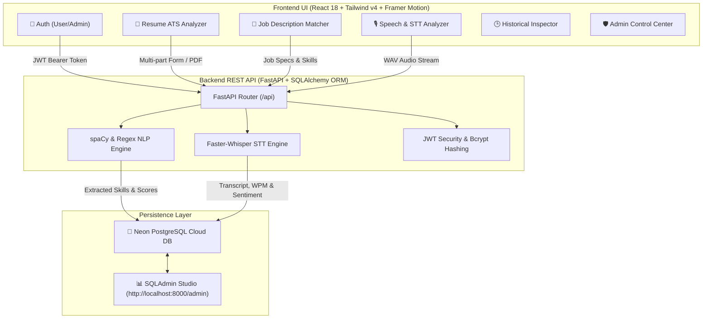

# 🚀 HireSense AI — Full-Stack AI Recruitment & Interview Analytics Platform

<p align="center">
  
  
  
  
  
</p>

---

## 📌 Executive Summary

**HireSense AI** is a state-of-the-art, full-stack recruitment & interview analytics platform. It leverages **NLP skill extraction algorithms**, **Faster-Whisper speech-to-text models**, **ATS readability evaluation**, and **real-time career trajectory analytics** to empower job seekers and recruiters with actionable insights.

---

## 🏗️ System Architecture & Data Flow



---

## 🌟 Key Features

- **🔐 Dual-Role Security**:
  - **User Role**: Register & Login with exactly 6-digit passwords. Self-service "Forgot Password?" recovery and password change panel.
  - **Admin Role**: Controlled access for `chirag@hiresense.ai` (**Chirag Roshan**). Includes security disclaimer card prohibiting profile password changes.
- **📄 Resume ATS Analytics**: Parse PDF/TXT resumes, compute ATS compatibility scores (0–100), extract technical skills, and check formatting standards.
- **💼 Job Description Matching**: Match candidate profiles against job requirements, highlighting matched skills (in green) and missing skill gaps (in amber/red).
- **🎙️ Speech-to-Text & Interview Analytics**: Speech capture powered by `faster-whisper` and Web Speech API, Words Per Minute (WPM) calculation, filler word frequency count, and sentiment analysis.
- **📊 Real-time Admin Telemetry**: Aggregate metrics (Total Users, Total Analyses, Avg Resume/Speech Scores, Top Skills & Missing Skill Gaps) calculated dynamically from live database queries.
- **🗄️ Embedded Database Studio**: Integrated SQLAdmin visual database dashboard (`http://localhost:8000/admin`) similar to Prisma Studio for live inspection across all 6 tables.

---

## 🌐 Server Ports & Network Mapping

| Service Name | Technology / Framework | Access Endpoint URL | Description |
| :--- | :--- | :--- | :--- |
| **Frontend Web App** | React 18 + Vite | `http://localhost:5173` | Interactive Glassmorphic UI Dashboard |
| **Backend REST API** | FastAPI + Uvicorn | `http://localhost:8000/api` | REST API Router & Services |
| **Interactive OpenAPI Docs** | Swagger / OpenAPI | `http://localhost:8000/docs` | Interactive Swagger API Documentation |
| **Visual Database Studio** | SQLAdmin | `http://localhost:8000/admin` | Interactive Database Inspector (Prisma Equivalent) |
| **Database Server** | Neon PostgreSQL | Cloud Hosted (us-east-2) | Managed Relational PostgreSQL Instance |

---

## 🔑 Demo Credentials

| Role | Name | Email | Password |
| :--- | :--- | :--- | :--- |
| **Admin** | Chirag Roshan | `chirag@hiresense.ai` | `123456` |
| **User** | Test User | `testuser@hiresense.ai` | `123456` |

---

## 🚀 Local Installation & Execution Guide

### 1. Prerequisites
- **Node.js**: `v18.0.0` or higher
- **Python**: `v3.10.0` or higher

---

### 2. Backend Setup & Database Migration

```cmd
cd backend

# 1. Create and activate virtual environment
python -m venv venv
venv\Scripts\activate

# 2. Install Dependencies
pip install -r requirements.txt

# 3. Create .env file from template
copy .env.example .env

# 4. Run Alembic Database Migrations & Seed Admin User
alembic upgrade head
python -m app.seed

# 5. Start Backend FastAPI Server
python -m uvicorn app.main:app --reload --port 8000
```

---

### 3. Frontend Setup & Launch

Open a second command prompt:

```cmd
cd frontend

# 1. Install Node Dependencies
npm install

# 2. Start Frontend Development Server
npm run dev
```

Visit **`http://localhost:5173`** in your browser!

---

## 🧪 Verified QA Test Suite

The project includes a complete verified Manual QA Test Plan covering **20 Test Cases (TC-USER-01 to TC-USER-10 and TC-ADMIN-01 to TC-ADMIN-10)** available in `hiresense_ai_test_plan.md`.

---

## 👤 Author & Repository

- **Author**: Chirag Roshan


