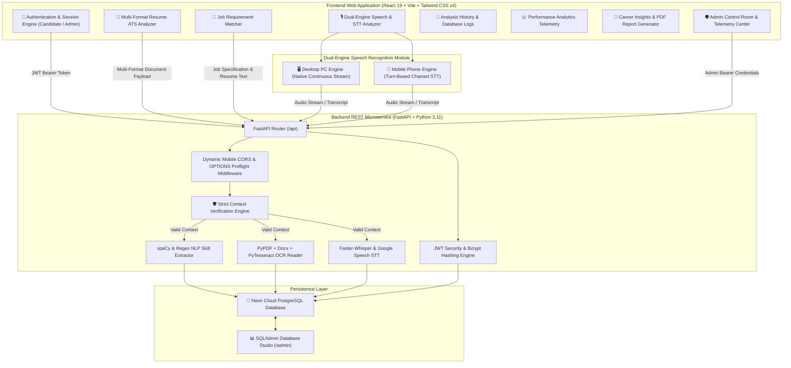

<div align="center">

  <h1>🛡️ HireSense AI</h1>
  <p><b>Advanced Full-Stack AI Recruitment & Career Telemetry Platform</b></p>

  <p>
    <a href="https://hiresenseai-zeta.vercel.app/" target="_blank">
      
    </a>
    
    
    
    
    
  </p>

</div>

---

## 📌 Executive Overview

**HireSense AI** is a state-of-the-art, production-grade recruitment intelligence and interview telemetry platform. Designed with a high-performance **Glassmorphic UI**, it empowers candidates and recruiters through real-time NLP skill analysis, multi-format document OCR, dual-engine speech-to-text processing, and dynamic database telemetry.

Unlike generic recruitment tools, **HireSense AI** enforces strict **Context Verification**: invalid non-resume documents (e.g. wallpapers, non-text photos, or random exam notes), incomplete job specifications, or empty speech transcripts are cleanly rejected with explicit HTTP 400 errors instead of generating hardcoded or fake placeholder scores.

---

## 🏗️ System Architecture



---

## 🌟 Core System Enhancements & Rejection Logic

### 1. 🛡️ Strict Context Verification Engine
- **Resume Analysis Rejection**:
  - Every uploaded file (PDF, DOCX, DOC, TXT, Image) or text input is evaluated by `validate_resume_context(text)`.
  - Non-resume photos (e.g. scenery or wallpapers) or random text lacking career background (< 15 words or missing career keywords) are **immediately REJECTED** with an explicit HTTP 400 alert:
    > `"Document rejected: Missing resume context. Uploaded file does not contain valid career experience, skills, or professional background."`
  - **Zero Hardcoded Fallbacks**: No fake ATS scores, no fake skills, and zero invalid records are saved to PostgreSQL.

- **Job Description Matcher Rejection**:
  - Requires a detailed job specification (minimum 10 words). Short or missing inputs trigger `HTTP 400: Job match rejected: Missing job description context`.
  - Computes skill overlaps and missing gaps **strictly from the two provided texts** without hardcoded skill arrays (`["Python", "FastAPI", "Docker", "AWS", "SQL"]`).

- **Speech & Interview STT Rejection**:
  - Validates transcript length (minimum 4 words). Empty or un-transcribed audio streams trigger `HTTP 400: Speech analysis rejected: Missing speech transcript context`.

---

### 2. 🎙️ Dual-Engine Speech Recognition Architecture
- **Desktop PC Engine (`startDesktopEngine`)**:
  - Native `continuous = true` engine optimized for Desktop Chrome and Edge.
  - Captures continuous multi-sentence interview responses without terminating early between sentences.
- **Mobile Phone Engine (`startMobileEngine`)**:
  - Turn-based chained STT engine optimized for **Mobile Safari (iOS)** and **Mobile Chrome (Android)**.
  - Eliminates mobile audio buffer phrase duplication (*"hello world hello world"*) and locks UI recording state seamlessly to prevent button flickering.

---

### 3. 📊 Dynamic Zero-Baseline Admin Control Room
- **Real-Time Database Aggregation**:
  - Monitors total registered candidates, aggregate analyses executed, average resume ATS ratings, average interview scores, system health microservices, top detected candidate skills, and top missing skill gaps.
- **Zero-Hardcoding Guarantee**:
  - On a fresh database with 0 candidate submissions, metrics display exact zero baselines (`0%` and `No candidate skill data recorded yet`) rather than fake fallback numbers.
- **Dynamic Skill Ranking**:
  - As candidates submit resumes and job matches, the Admin Control Center dynamically ranks the **Top 5 Detected Skills** (e.g. *Communication, GitHub, Python*) and **Top 5 Missing Skill Gaps** (e.g. *Docker, AWS, Kubernetes*) directly from Neon PostgreSQL records.

---

## 👥 Roles & Platform Capabilities

### 👤 Candidate / User Capabilities
- **📄 Resume ATS Analyzer**: Upload resumes in PDF, DOCX, DOC, TXT, or Image format to receive real ATS readability scores, word counts, and extracted skills.
- **🎯 Job Requirement Matcher**: Evaluate alignment against target job specifications, identifying matched skills and missing competency gaps.
- **🎙️ Speech & Interview STT**: Record live interview answers to analyze Words Per Minute (WPM), filler word frequency (`um`, `uh`), sentiment tone, and articulation clarity.
- **📜 Analysis History**: Review past validated candidate analyses stored securely in Neon PostgreSQL.
- **📈 Performance Analytics**: Track score progression over time across resume ATS ratings, job matches, and verbal articulation.
- **📄 Career Insights & PDF Report Export**: Download formal PDF candidate evaluation summaries (`HireSense_AI_Career_Report.pdf`) featuring real-time database metrics.

### 🛡️ Admin Capabilities
- **Platform Control Center (`chirag@hiresense.ai`)**: Inspect platform-wide telemetry, system health microservices, candidate user directory, and aggregate skill analytics.
- **SQLAdmin Visual Studio (`/admin`)**: Inspect underlying relational database tables (`users`, `resumes`, `job_matches`, `speech_analyses`).

---

## 🌐 Live Production Endpoints

| Component | Provider | URL Endpoint |
| :--- | :--- | :--- |
| **Frontend Application** | Vercel | [https://hiresenseai-zeta.vercel.app/](https://hiresenseai-zeta.vercel.app/) |
| **Backend REST API** | Render | `https://hiresense-ai-backend-km18.onrender.com/api` |
| **OpenAPI Documentation** | Render | `https://hiresense-ai-backend-km18.onrender.com/docs` |
| **Relational Database** | Neon Cloud | Managed PostgreSQL (us-east-2) |

---

## 🔑 Demo Credentials

| Role | Name | Email Address | Password |
| :--- | :--- | :--- | :--- |
| **Admin** | Chirag Roshan | `chirag@hiresense.ai` | `123456` |
| **User (Candidate)** | Test Candidate | `exhaustignite@gmail.com` | `123456` |

---

## 🛠️ Technology Stack

- **Frontend**: React 19, Vite, Tailwind CSS v4, Framer Motion, Lucide Icons, Axios, jsPDF, html2canvas.
- **Backend**: FastAPI, Python 3.11, SQLAlchemy ORM, Neon Cloud PostgreSQL, PyPDF, Python-Docx, PyTesseract OCR, Faster-Whisper, SpeechRecognition, SQLAdmin.
- **Security & Infrastructure**: JWT Authentication, Password Hashing (Bcrypt), Custom OPTIONS Preflight CORS Middleware, NUL-Byte DB Sanitization.

---

## 🚀 Local Setup Guide

```cmd
# 1. Clone Repository
git clone https://github.com/chiragroshan18/hiresenseai.git
cd hiresenseai

# 2. Setup & Start Backend
cd backend
python -m venv venv
venv\Scripts\activate
pip install -r requirements.txt
python -m uvicorn app.main:app --reload --port 8000

# 3. Setup & Start Frontend (in a second terminal)
cd frontend
npm install
npm run dev
```

Visit `http://localhost:5173` in your browser.

---

## 📄 License

Developed & Maintained by **Chirag Roshan** for **HireSense AI**.  
Distributed under the **MIT License**.
