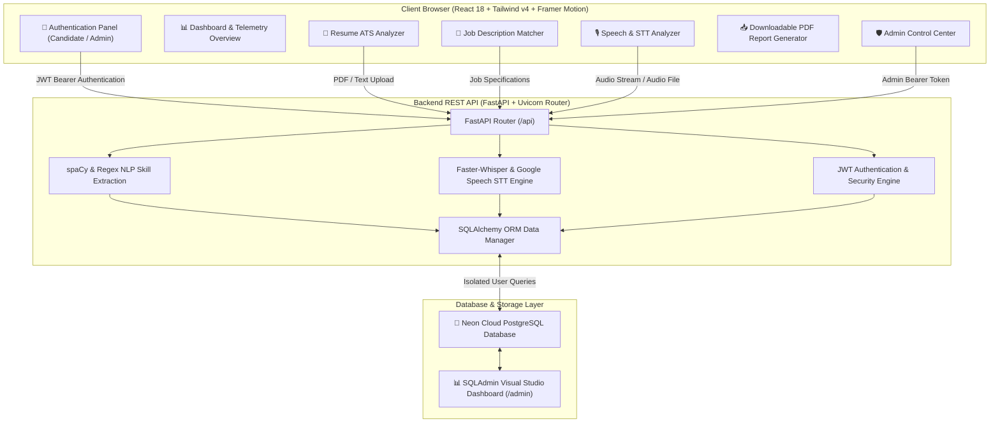

# 🚀 HireSense AI — Full-Stack AI Recruitment & Interview Analytics Platform

<p align="center">
  <a href="https://hiresenseai-zeta.vercel.app/" target="_blank">
    
  </a>
  
  
  
  
  
</p>

---

## 📌 Executive Overview

**HireSense AI** is an end-to-end recruitment intelligence and interview analytics platform. Designed with a high-performance **Glassmorphic UI**, it empowers candidates and recruiters through:

- **📄 Resume ATS Scoring**: Parse PDF/TXT resumes, compute ATS readability (0–100%), and extract core technical skills using NLP engines.
- **💼 Job Requirement Matcher**: Evaluate candidate profile fit against target job descriptions, highlighting matched skills and pinpointing missing competency gaps.
- **🎙️ Speech-to-Text & Interview Analytics**: Capture real-time interview responses using `faster-whisper` and Web Speech APIs to measure Words Per Minute (WPM), filler word counts, sentiment, and articulation clarity.
- **📈 Personal Career Telemetry**: Generate interactive performance progress charts and downloadable PDF reports.
- **🛡️ Multi-Role Security & Admin Telemetry**: Dual-role JWT authentication architecture separating individual Candidate Workspaces from the Platform Admin Control Room.

---

## 🌐 Live Production Deployment

| Service Component | Host Provider | URL Endpoint |
| :--- | :--- | :--- |
| **Frontend Web Application** | Vercel | [https://hiresenseai-zeta.vercel.app/](https://hiresenseai-zeta.vercel.app/) |
| **Backend REST API** | Render | `https://hiresense-ai-backend-km18.onrender.com/api` |
| **OpenAPI Documentation** | Render | `https://hiresense-ai-backend-km18.onrender.com/docs` |
| **Relational Database** | Neon Cloud | Managed PostgreSQL (us-east-2) |

---

## 🏗️ System Architecture & Data Flow



---

## 🌟 Key Platform Features

### 1. 🔐 Dual-Role Authentication & Security
- **Candidate Account Workspace**:
  - Sign Up and Login with 6-digit numeric passwords.
  - Self-service password recovery (`Forgot Password`) and in-profile password management.
  - **Strict Per-User Data Isolation**: User records (resumes, job matches, speech transcripts) are scoped strictly to the authenticated `user_id`. New accounts start cleanly with zeroed history.
- **Admin Control Room**:
  - Secure login reserved for `chirag@hiresense.ai` (**Chirag Roshan**).
  - Platform-wide telemetry monitoring total registered users, aggregate resume/speech scores, and top detected skill gaps.

### 2. 📄 AI Resume ATS Analytics
- Instant PDF and plain-text document parsing.
- Skill density evaluation matching against 100+ standard technical frameworks.
- Word count analysis and formatting compliance recommendations.

### 3. 💼 Job Description Matcher
- Side-by-side comparison of candidate experience against position requirements.
- Visual badge highlights for matched skills (green) and skill gaps (amber/red).

### 4. 🎙️ Speech-to-Text & Interview Articulation
- Audio recording powered by Web Speech API and `faster-whisper`.
- Words Per Minute (WPM) speed calculation and filler word detection (`um`, `uh`, `like`, `you know`).
- Sentiment classification (Positive, Neutral, Analytical).

### 5. 📈 PDF Career Telemetry Export
- Generate and download formal, formatted PDF candidate reports (`HireSense_AI_Career_Report.pdf`) featuring ATS scores, job match metrics, strengths, and actionable improvement recommendations.

---

## 🔑 Demo Credentials

| Role | Name | Email Address | Password |
| :--- | :--- | :--- | :--- |
| **Admin** | Chirag Roshan | `chirag@hiresense.ai` | `123456` |
| **User** | Demo User | `testuser@hiresense.ai` | `123456` |

---

## 🚀 Local Installation & Setup Guide

### Prerequisites
- **Node.js**: `v18.0.0` or higher
- **Python**: `v3.10.0` or higher
- **Git**

---

### 1. Backend Setup (FastAPI)

```cmd
# Navigate to backend directory
cd backend

# Create and activate Python virtual environment
python -m venv venv
venv\Scripts\activate

# Install required Python dependencies
pip install -r requirements.txt

# Create .env environment file
copy .env.example .env

# Run database migrations & seed admin user
alembic upgrade head
python -m app.seed

# Start FastAPI development server
python -m uvicorn app.main:app --reload --port 8000
```

The backend server will run at `http://localhost:8000`. You can inspect:
- **Interactive OpenAPI Documentation**: `http://localhost:8000/docs`
- **Visual SQLAdmin Studio**: `http://localhost:8000/admin`

---

### 2. Frontend Setup (React 18 + Vite)

Open a second terminal window:

```cmd
# Navigate to frontend directory
cd frontend

# Install Node dependencies
npm install

# Start Vite dev server
npm run dev
```

Visit **`http://localhost:5173`** in your web browser.

---

## 🛠️ Technology Stack

```
HireSense AI Stack
├── Frontend: React 18.3, Vite, Tailwind CSS v4, Framer Motion, Recharts, Lucide Icons, jsPDF
├── Backend: FastAPI, Uvicorn, SQLAlchemy ORM, Pydantic v2, Python-Jose (JWT), Passlib (Bcrypt)
├── NLP & AI: Faster-Whisper, SpeechRecognition, spaCy, Scikit-learn, PyPDF
└── Database: Neon Cloud PostgreSQL, SQLite (Local Dev Fallback), SQLAdmin Studio
```

---

## 📄 License & Attribution

Developed & Maintained by **Chirag Roshan** for **HireSense AI**.

Distributed under the **MIT License**.
